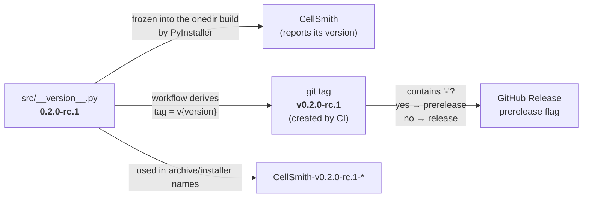
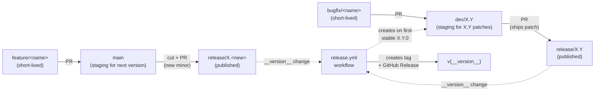
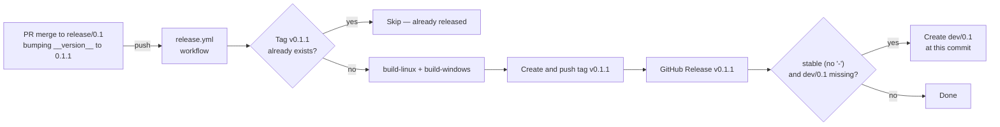
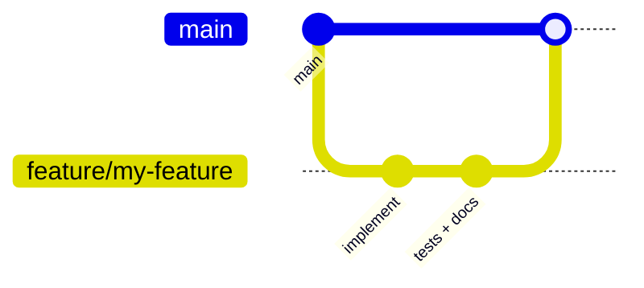
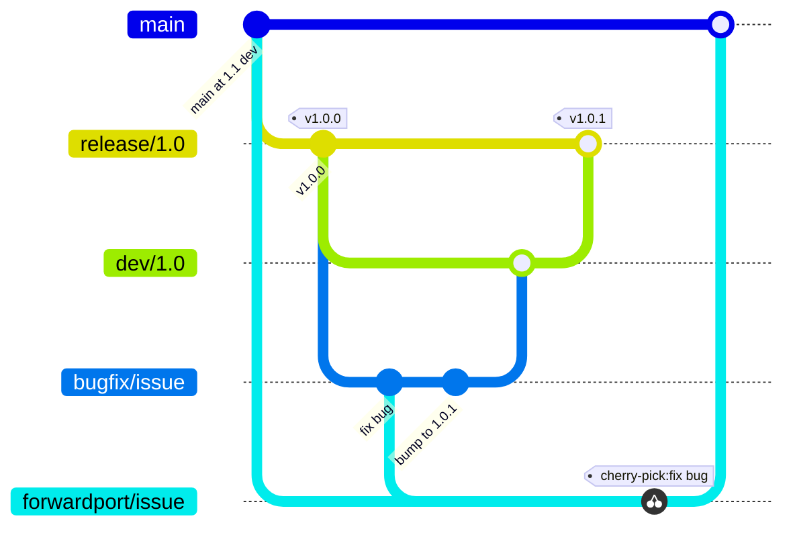

# Contributing

This document describes the branch model, version conventions, release process, and branch
    protection rules for CellSmith. It's organized by what you're trying to do: start with
    [Overview](#overview) for the mental model, then jump to the section that matches your task:

- [Adding a feature](#adding-a-feature)
- [Creating a bug fix](#creating-a-bug-fix)
- [Creating a new release](#creating-a-new-release)
- [Branch protection rules](#branch-protection-rules)


## Overview

### Branch naming conventions

| Branch | Lifetime | Purpose |
|---|---|---|
| `main` | long-lived, protected | Staging area for the next minor release. All new features land here first. |
| `release/X.Y` | long-lived, protected | Published release branch for version line `X.Y`. Pushes that modify `__version__` here trigger the release workflow and ship `vX.Y.Z`. |
| `dev/X.Y` | long-lived, protected | Staging area for `X.Y.x` patches (`X.Y.1`, `X.Y.2`, …). Created automatically by the release workflow when the first stable `X.Y.0` ships. |
| `feature/<short-name>` | short-lived | Feature work, branched off `main`, merged back via PR. |
| `bugfix/<short-name>` | short-lived | Bug fixes for an existing release line, branched off `dev/X.Y`, merged back via PR. |
| `forwardport/<short-name>` | short-lived | Forward-ports a bug fix from `dev/X.Y` to `main`. |

### Version naming conventions

Versions follow [semver](https://semver.org/): `MAJOR.MINOR.PATCH[-PRERELEASE]`.

- `0.2.0-alpha.1` — early prerelease, internal testing
- `0.2.0-beta.1` — feature-complete prerelease, broader testing
- `0.2.0-rc.1` — release candidate, expected to become the stable release
- `0.2.0` — stable release (no suffix)

The `-` suffix is the semver pre-release marker. Any value matching `X.Y.Z-<anything>` produces a
    prerelease on GitHub; a bare `X.Y.Z` produces a stable release.

`__version__` in [`src/__version__.py`](src/__version__.py) is the **single source of truth** —
    there is no second version string to keep in sync. Bumping the file *is* cutting the release.



The value of `__version__` drives:

1. **The application's self-reported version** (`CellSmith --version`), frozen into the build and
    into the Windows `.exe` file properties via
    [`packaging/cellsmith.spec`](packaging/cellsmith.spec).
2. **The git tag created by the workflow**, formatted as `v{__version__}`.
3. **The release artifact filenames** — `CellSmith-v{__version__}-win64.zip`,
    `CellSmith-v{__version__}-setup.exe`, `CellSmith-v{__version__}-linux-x86_64.tar.gz`, and
    `cellsmith_{__version__}_amd64.deb`.
4. **Whether GitHub marks the release as a prerelease**, determined by whether `__version__`
    contains a `-`.

### Branch flow



Every published release flows through a staging branch (`main` for the next version, `dev/X.Y` for
    older lines) into the corresponding protected `release/*` branch. The push that lands the
    `__version__` change on `release/*` is what triggers the workflow.

### Triggering a release

The workflow fires on **pushes to `release/*` branches that modify `src/__version__.py`**. The path
    filter means non-version commits on a release branch (e.g. dependency bumps, doc fixes) do not
    trigger a release.



Before building, the workflow validates two things:

- **`__version__` is valid semver** (`MAJOR.MINOR.PATCH[-PRERELEASE]`).
- **The branch name matches the version's `X.Y`** — `release/0.1` must hold a `0.1.x` version, not
    `0.2.x`. This catches the "merged the wrong PR into the wrong branch" mistake.

If the tag implied by `__version__` already exists on the remote, the workflow skips (preventing
    re-runs on a non-version commit, or on the same commit being pushed twice). To re-run a release
    — for example if the artifact upload flaked — invoke the workflow manually via the **Run
    workflow** button on the Actions tab, selecting the appropriate `release/X.Y` branch; manual
    runs proceed even when the tag already exists, and the existing GitHub Release is updated in
    place.

After publishing, the workflow creates the line's `dev/X.Y` staging branch if it doesn't already
    exist — but **only for stable releases** (`__version__` without a `-` suffix). It's seeded from
    the just-released commit, so a freshly created `dev/X.Y` is identical to `release/X.Y`.
    Prereleases skip this step, and once `dev/X.Y` exists the workflow never touches it again. For
    this to work, branch protection on `dev/*` must allow the workflow to create branches (see
    [Branch protection rules](#branch-protection-rules)).


## Adding a feature

New features always land on `main` first via a short-lived feature branch. They ship in the next
    minor release.



```bash
git fetch origin
git switch main
git pull --ff-only

# Create a feature branch off main
git switch -c feature/short-description

# ... make changes ...
git add -A
git commit -m "describe the change"

git push -u origin feature/short-description
```

On GitHub, open a PR with **base: `main`** and **compare: `feature/short-description`**. After
    review and merge, delete the feature branch.

The feature is now on `main` but does not appear in any release until either:

- a new minor is cut (see [Creating a new release](#creating-a-new-release)), or
- the feature is forward-ported into an existing `dev/X.Y` branch (uncommon — usually new features
    aren't backported to older lines).


## Creating a bug fix

Bug fixes for an existing released line flow through `dev/X.Y` (staging) → `release/X.Y`
    (published), then are forward-ported to `main` so future minor releases inherit the fix.

Assume `v1.0.0` is shipped, `v1.1.0-rc.1` is in development on `main`, and a bug is found in 1.0.0
    that also exists on `main`.



`dev/1.0` already exists here — the release workflow created it from `release/1.0` when `v1.0.0`
    shipped, so you branch straight off it.

### 1. Create a bugfix branch off `dev/X.Y`

```bash
git fetch origin
git switch dev/1.0
git pull --ff-only

git switch -c bugfix/issue-summary

# ... make the fix ...
# Bump src/__version__.py to "1.0.1" — this is what triggers the release on merge
git add -A
git commit -m "fix: short description, bump to 1.0.1"

git push -u origin bugfix/issue-summary
```

### 2. PR the bugfix into `dev/X.Y`

Open a PR with **base: `dev/1.0`** and **compare: `bugfix/issue-summary`** and merge. Nothing
    ships yet — `dev/X.Y` is staging, not published.

### 3. Forward `dev/X.Y` into `release/X.Y` to ship

On GitHub, open a PR with **base: `release/1.0`** and **compare: `dev/1.0`** and merge. The merge
    brings the `__version__` bump into `release/1.0`, fires the release workflow, and publishes
    `v1.0.1`.

### 4. Forward-port the fix to `main`

If the bug also exists on `main`, cherry-pick the fix commit(s) into a forwardport branch off
    `main`. You want to bring the fix across but **not** the `__version__` bump (`main`'s version
    line is independent of `1.0.x`).

```bash
git fetch origin
git switch main
git pull --ff-only
git switch -c forwardport/issue-summary
```

For a single-commit fix, cherry-pick the SHA:

```bash
git cherry-pick <fix-commit-sha>
```

For multiple fix commits, list them or cherry-pick a range:

```bash
# List individually (oldest first):
git cherry-pick <c1> <c2> <c3>

# Or as a range. `A^..B` means commit A inclusive through commit B inclusive:
git cherry-pick <first-fix>^..<last-fix>

# Or, if `bugfix/issue-summary` is structured as [fix commits...] + [__version__ bump],
# cherry-pick everything new on the bugfix branch except its last commit:
git cherry-pick dev/1.0..bugfix/issue-summary~1
```

Conflicts can surface on any commit in a multi-commit cherry-pick. Resolve files, stage them with
    `git add`, and continue with `git cherry-pick --continue` (or `git cherry-pick --abort` to bail
    entirely).

```bash
git push -u origin forwardport/issue-summary
```

Open a PR with **base: `main`** and **compare: `forwardport/issue-summary`** and merge.

### Reverse direction (fix on `main` first)

If the bug is easier to reproduce on `main`, develop the fix there first, then cherry-pick the fix
    commit onto a bugfix branch off `dev/1.0` (which also bumps `__version__`), and PR into
    `dev/1.0`. Pick whichever direction lets you reproduce and verify the bug most easily.

### Backporting across multiple older lines

If the same bug needs to ship in multiple older lines (e.g. `1.0.x` and `1.1.x`), repeat steps 1–3
    for each `dev/X.Y` independently. Each line needs its own `__version__` bump (`1.0.1` for
    `dev/1.0`, `1.1.1` for `dev/1.1`), so each backport is its own bugfix branch and PR pair.

### Squash-merge alternative

If multi-commit forward-ports become routine, consider configuring `dev/*` to use **Squash and
    merge** for bugfix PRs — every bugfix then lands on the dev branch as a single commit, and
    forward-porting is always a single `git cherry-pick`. Trade-off: the granular history of how
    the fix was built up is collapsed. If you also want to keep the `__version__` bump out of the
    squashed commit, split the bugfix into two PRs (fix-only, then bump).


## Creating a new release

"New release" here means cutting a new minor version (e.g. `1.0` → `1.1`): a new `release/X.Y`
    branch with its initial `X.Y.0` release. Patch releases on an existing line are covered in
    [Creating a bug fix](#creating-a-bug-fix).

Mechanically: land the `__version__` bump on `main`, then forward `main` into `release/X.Y` with a
    **merge commit**. If the line is brand new, you create `release/X.Y` first. Both cases are below.

You no longer create `dev/X.Y` by hand. The release workflow creates `dev/X.Y` automatically when
    the **first stable `X.Y.0`** of the line ships, seeded from that released commit (see
    [Triggering a release](#triggering-a-release)). Prereleases (`-rc`, `-beta`, …) don't create it,
    so `dev/X.Y` never lags behind `release/X.Y` at a prerelease commit.

```mermaid
gitGraph
    commit id: "main: 1.0 leading edge"
    branch release/1.1
    checkout main
    commit id: "bump to 1.1.0-rc.1"
    checkout release/1.1
    merge main tag: "v1.1.0-rc.1"
    checkout main
    commit id: "bump to 1.1.0"
    checkout release/1.1
    merge main tag: "v1.1.0"
    branch dev/1.1
    checkout main
    commit id: "next feature"
```

`dev/1.1` above is created by the workflow off `release/1.1` at the `v1.1.0` commit — not by you.

### 1. Initial release — `release/X.Y` does not exist yet

1. Land all changes, **including the `__version__` bump**, on `main`.

1. Create `release/X.Y` pointing at a commit *behind* the bump, then push it:

    ```bash
    # Branch off main, then move it back to a commit that predates the version bump.
    # 7353006 is the current pre-bump baseline — update this SHA next time a new line is cut.
    git switch -c release/X.Y origin/main
    git reset --hard 7353006
    git push -u origin release/X.Y
    ```

    Creating the branch does **not** trigger the release workflow.

1. Open a PR **base: `release/X.Y`**, **compare: `main`** and merge with **Create a merge commit** —
    this fires the pipeline and publishes `vX.Y.Z`.

*Why start the branch behind the bump?* The release fires on the `main → release/X.Y` PR, and only
    if that PR actually changes `__version__` on `release/X.Y`. If `release/X.Y` already equalled
    `main` the PR would be empty and nothing would ship — so the branch starts behind the bump and
    the forward carries the version change.

### 2. Subsequent release — `release/X.Y` already exists

1. Land all changes, **including the `__version__` bump**, on `main`.

1. Open a PR **base: `release/X.Y`**, **compare: `main`** and merge with **Create a merge commit** —
    this fires the pipeline and publishes `vX.Y.Z`.

The first **stable** `X.Y.0` shipped this way also makes the workflow create `dev/X.Y` (prereleases
    don't).

### One thing to watch

Forwarding `main` into `release/X.Y` ships **everything on `main` ahead of `release/X.Y`**, not just
    the version bump. If there's unrelated work-in-flight on `main`, hold it until the release lands —
    there's no way to forward *only* the bump.


## Branch protection rules

Protection is configured with **Rulesets** (Settings → Rules → Rulesets), not classic branch
    protection. Repository-wide pull-request settings enable all three merge methods; the per-branch
    rulesets below then narrow them and layer on the protections. Rulesets are **additive** — when
    more than one targets a branch, every rule applies and bypasses are evaluated per-ruleset (so an
    actor in one ruleset's bypass list is still bound by every other ruleset that lacks it).

### Repository pull request settings

`Settings > General > Pull Requests`

| Setting | Value |
|---|---|
| Allow merge commits | true (Default message) |
| Allow squash merging | true (Default message) |
| Allow rebase merging | true |

All three are enabled because a ruleset can only *narrow* the allowed merge methods, never add one.
    The per-branch rulesets restrict the actual choice: **Merge** into `release/*`, **Squash** into
    `main`/`dev/*`.

### Branch Ruleset: Release

| Setting | Value |
|---|---|
| Bypass List | [] |
| Target Branches | [release/*] |
| Restrict Creations | false |
| Restrict Updates | false |
| Restrict Deletions | true |
| Require Linear History | false |
| Require deployments to succeed | false |
| Require signed commits | false |
| Require a pull request before merging | true |
| Required approvals | 0 |
| Dismiss Stale pull request approvals when new commits are pushed | true |
| Require review from specific teams | false |
| Require review from Code Owners | false |
| Require approval of the most recent reviewable push | false |
| Require conversation resolution before merging | true |
| Allowed merge methods | [Merge] |
| Require status checks to pass | true |
| Require branches to be up to date before merging | false |
| Do not require status checks on creation | false |
| Status checks that are required | [build-windows, build-linux, version-check] |
| Block force pushes | true |

Rationale:

- **Linear history off + merge methods = [Merge]** is the heart of the release flow: forwarding
    `main` into `release/X.Y` lands as a *merge commit*, so `release/X.Y` keeps main's real commit
    SHAs as ancestors and future forwards stay conflict-free. Squash or rebase would fork the
    history under new SHAs and re-introduce conflicts on every forward.
- **Require branches up to date = off** — leaving it on would force `main` (the PR head) to contain
    `release/*`'s accumulated merge commits before each forward, demanding back-merges of `release/*`
    into `main`. Off avoids that.
- **`version-check` is required here** (and only here): it validates that `__version__`'s `X.Y`
    matches the target `release/X.Y` *before* merge, catching the "wrong version on the wrong branch"
    mistake pre-merge. A new release branch must be cut from a commit that already contains the
    `version-check` job (i.e. current `main`), or the required check can't report and the PR hangs.
- **Restrict Creations = false here**; creation is restricted in the separate *Release Create and
    Approve* ruleset so that restriction can carry an admin bypass without also exempting admins
    from this ruleset's checks and merge-method rules.

### Branch Ruleset: Release Create and Approve

| Setting | Value |
|---|---|
| Bypass List | [Organization admin (Always allow), Repository admin (Always allow)] |
| Target Branches | [release/*] |
| Restrict Creations | true |
| Require a pull request before merging | true |
| Required approvals | 1 |

All other settings false.

This overlays `release/*` with the rules that should be **admin-bypassable**. Restrict Creations
    limits who can cut a new `release/X.Y` to admins (the release workflow never creates release
    branches — you do). Required approvals = 1 means collaborators need a review, while an admin can
    self-merge. Because bypass is per-ruleset, an admin bypasses *only* creation + approval here and
    is still bound by the base *Release* ruleset's PR requirement, status checks, and Merge-only
    method.

> **Why "Require approval of the most recent reviewable push" is off everywhere.** That setting
> lives on the base *Release* / *Main and Dev* rulesets, which have **no bypass list** — so it
> applies even to admins, and it requires an approval from someone *other than* the last pusher.
> With a solo maintainer (you can't approve your own PR) and no bypass, it makes every `release/*`
> forward unmergeable. The approval gate for collaborators is kept via *Required approvals = 1* on
> this ruleset (which admins **can** bypass); don't re-enable "most recent reviewable push" on the
> base rulesets unless you also move it onto a ruleset that admins can bypass.

### Branch Ruleset: Main and Dev

| Setting | Value |
|---|---|
| Bypass List | [] |
| Target Branches | [main, dev/*] |
| Restrict Creations | false |
| Restrict Updates | false |
| Restrict Deletions | true |
| Require Linear History | true |
| Require deployments to succeed | false |
| Require signed commits | false |
| Require a pull request before merging | true |
| Required approvals | 0 |
| Dismiss Stale pull request approvals when new commits are pushed | true |
| Require review from specific teams | false |
| Require review from Code Owners | false |
| Require approval of the most recent reviewable push | false |
| Require conversation resolution before merging | true |
| Allowed merge methods | [Squash] |
| Require status checks to pass | true |
| Require branches to be up to date before merging | true |
| Do not require status checks on creation | false |
| Status checks that are required | [build-windows, build-linux] |
| Block force pushes | true |

Rationale:

- **Linear history on + merge methods = [Squash]** keeps `main` and `dev/X.Y` a clean, linear
    staging history; features and bugfixes squash in.
- **Restrict Creations = false is intentional and must stay off.** The release workflow's
    `github-actions[bot]` auto-creates `dev/X.Y` on the first stable `X.Y.0`, and the default
    `GITHUB_TOKEN` **cannot be added to a ruleset bypass list** (the built-in Actions identity isn't
    a selectable bypass actor). `main` already exists and can't be recreated (deletion is blocked),
    so leaving creation open costs nothing — and pushes to *existing* branches are still PR-gated.
    Adding a creation restriction here (even with an admin bypass) would block the bot and fail the
    release job on its final step. If you ever need creation locked down, give the workflow a
    bypassable identity (a GitHub App token or admin PAT) instead of restricting it for the bot.
- **`version-check` is not required here** — it's a no-op for non-`release/*` targets, so requiring
    it would only ever be an always-green check.

### Tag Ruleset: Tags

| Setting | Value |
|---|---|
| Bypass List | [Organization admin (Always allow), Repository admin (Always allow)] |
| Target Tags | All Tags |
| Restrict creations | false |
| Restrict updates | false |
| Restrict deletions | true |
| Require linear history | false |
| Require deployments to succeed | false |
| Require signed commits | false |
| Require status checks to pass | false |
| Block force pushes | true |

**Creations are open** so the release workflow can push `v*` tags; it only ever *creates* a tag
    (never force-updates one — see [`release.yml`](.github/workflows/release.yml), which reuses an
    existing tag rather than moving it), so **Block force pushes = true** doesn't interfere.
    **Restrict deletions = true with an admin bypass** keeps tags immutable to everyone except
    admins, who can still delete a botched tag to re-release.

### Pre-merge build check (`ci.yml`)

[`.github/workflows/ci.yml`](.github/workflows/ci.yml) runs on **`pull_request` events targeting
    `main`, `dev/*`, and `release/*`**. It runs the CI-eligible test tier (`make test-ci` /
    `test-ci.bat`) and freezes the app on both shipped platforms, then asserts the payload is
    actually usable — the launcher reports `--version`, an unknown `--worker` is rejected, the
    Qt plugin directory is populated, and the third-party notices are present. That catches build,
    packaging, and import breakage *before* a PR merges.

It deliberately **skips the slow packaging steps** — no `.zip`, no installer, no `.deb`, no artifact
    upload — because those add ~15 minutes and only the release workflow needs them. It also runs
    `version-check`, which is a no-op unless the PR targets `release/*` (above). Required
    status-check names appear in a ruleset's search box after the workflow has run once on a PR.

The release workflow itself is **not** a required status check: it runs *after* merge (its trigger
    is the resulting push to `release/*`), so it can't be a pre-merge gate — which is exactly why
    build/version validation lives in `ci.yml`.

### Workflow permissions

The release workflow pushes tags and creates the `dev/X.Y` branch. The default `GITHUB_TOKEN`
    already has `contents: write` (set in
    [`.github/workflows/release.yml`](.github/workflows/release.yml) under `permissions:`). Tag
    pushes are allowed by the Tags ruleset (creations open); the `dev/X.Y` push relies on creations
    being open on the *Main and Dev* ruleset. If you've globally restricted workflow token
    permissions under **Settings → Actions → General → Workflow permissions**, ensure "Read and
    write permissions" is selected (or that the per-workflow `permissions: contents: write` override
    is honored).

### Things to verify

- **No conflicting org-level ruleset.** An org-wide ruleset that restricts branch creation would
    override these repo settings and block `dev/X.Y` auto-creation regardless of the *Main and Dev*
    setting above.
- **`dev/X.Y` auto-creation is untested until the first stable release.** When you cut `X.Y.0` (no
    `-` suffix), watch the release job's final step to confirm `dev/X.Y` is actually created.
